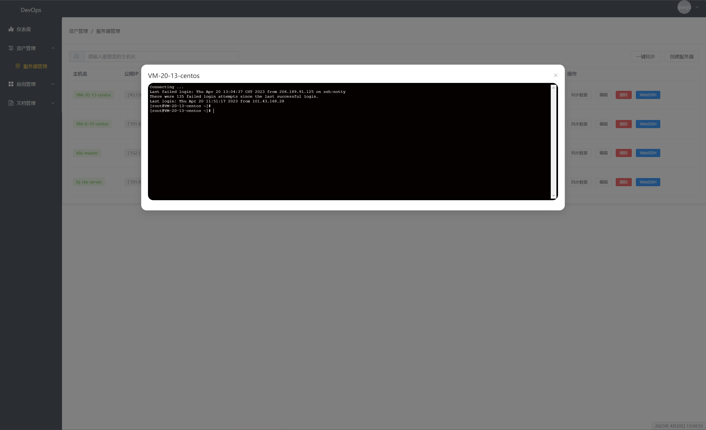
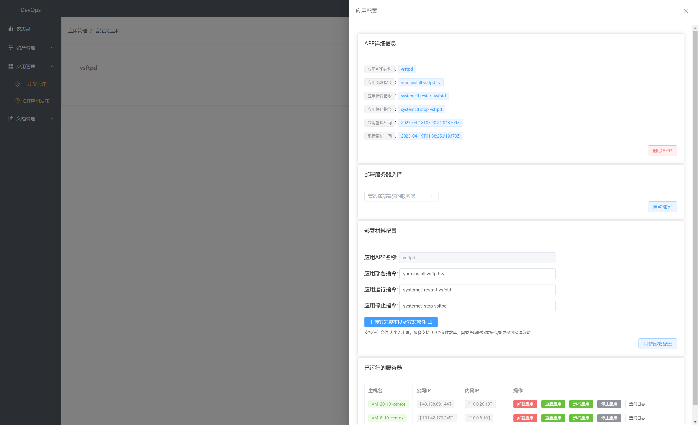

# Ftest DevOps运维平台

基于`Python Django==3.0.1 RestFramework`以及`vue3` 做的运维自动化平台

- Webssh功能

  

- 应用发布功能



# 安装方式

```shell
pip install -r ftest/requirements.txt
```

# 后端启动

## 配置数据库 

```shell
ftest/ftest.conf
#数据库服务器信息
[db]

db_host = 43.**.**.**
db_port = 3306
db_user = root
db_pass = ***
db_database = ***


#应用发布部署文件以及脚本存放位置
[uploadconf]

app_data_path = /data/ftestproject/ftest/data

```

## 生成数据库表

```shell
python manage.py makemigrations
python manage.py migrate
```

## 创建用户

```shell
python manage.py createsuperuser
```

## 运行项目

```shell
python3 manage.py runserver 0.0.0.0:8000
```


# 前端启动

配置域名、地址

```shell
cd ftestweb
.env 文件当中

VUE_APP_BASE_URL = 'http://127.0.0.1:8000'  #api地址 
VUE_APP_WEBSOCKET_URL = 'ws:/127.0.0.1:8000'    #ws地址
```

## 运行项目

```shell
cd ftestweb

npm install

npm run serve
```

# 服务器运行项目

### 前端配置服务器地址

```shell
ftestweb/.env

VUE_APP_BASE_URL = 'http://*.*.*.*:8900/internal'  #示例
VUE_APP_WEBSOCKET_URL = 'ws://*.*.*.*:8900/ws'   #示例
```


### 前端打包

```shell
npm install #安装模块
```

```shell
npm run build #打包
```

### 服务器运行前端项目

上传`ftsetweb/dist/`下的所有文件到服务器  如下:

```shell
[root@bj-ckx-server ftestproject]# ls
ftest  uwsgi  web

[root@bj-ckx-server ftestproject]# ls web/
css   favicon.ico  img  index.html  js
```

### 配置Nginx

```nginx
server {
    listen 80;
    server_name  _;

    access_log  /data/nginx/logs/access.log main;
    error_log /data/nginx/logs/error.log error;
    client_max_body_size 100M;
    client_body_buffer_size 100M; 
    
    location / {
        root  /data/ftestproject/web/;
        try_files $uri $uri /index.html;
    }

}
```

### 运行Nginx

```shell
[root@bj-ckx-server ftestproject]# nginx -s reload
```

## 服务器运行后端项目

安装依赖

```shell
pip3 install -r ftest/requirements.txt
```

### 配置数据库 以及 发布数据目录

```shell
ftest/ftest.conf
#数据库服务器信息
[db]

db_host = 43.**.**.**
db_port = 3306
db_user = root
db_pass = ***
db_database = ***


#应用发布部署文件以及脚本存放位置
[uploadconf]

app_data_path = /data/ftestproject/ftest/data

```

### 生成数据库表

```python
python manage.py makemigrations
python manage.py migrate
```

### 创建用户

```python
python manage.py createsuperuser
```

### 配置 uwsgi

```shell
uwsgi/uwsgi.ini

[uwsgi]

chdir = /data/ftestproject/ftest  #厚度按项目位置

socket = /data/ftestproject/uwsgi/uwsgi.sock

http = 0.0.0.0:8001  #监听端口

wsgi-file=/data/ftestproject/ftest/ftest/wsgi.py

processes = 4

pidfile = /data/ftestproject/uwsgi/uwsgi.pid

daemonize = /data/ftestproject/uwsgi/uwsgi.log
```

### 配置uwsgi运行脚本

```shell
uwsgi/start.sh

uwsgi --ini /data/ftestproject/uwsgi/uwsgi.ini
cd /data/ftestproject/ftest && nohup ./channel.sh &>> nohup.log &


uwsgi/stop.sh
ps -ef | grep uwsgi | grep -v grep | awk '{print $2}' | xargs kill
ps -ef | grep channel.sh | grep -v grep | awk '{print $2}' | xargs kill
ps -ef | grep daphne | grep -v grep | awk '{print $2}' | xargs kill
```

### 运行uwsgi

```shell
[root@bj-ckx-server ftestproject]# cd uwsgi/ && sh start.sh
```

### 配置Nginx

```nginx
server {
    listen 8900;
    server_name  _;

    access_log  /data/nginx/logs/access.log main;
    error_log /data/nginx/logs/error.log error;
    client_max_body_size 100M;
    client_body_buffer_size 100M; 
    
    location /internal/ {
        proxy_pass  http://127.0.0.1:8001/;
    }
    location /ws/ {
        proxy_pass  http://127.0.0.1:8002/;
        proxy_http_version 1.1;
        proxy_set_header Upgrade $http_upgrade;
        proxy_set_header Connection "Upgrade";
    }

}
```

### 运行Nginx

```shell
nginx -s reload
```

